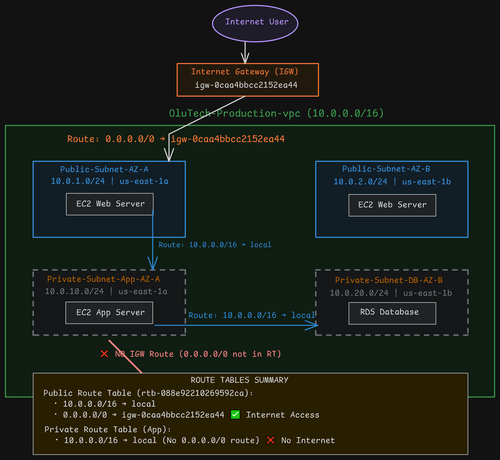

# OluTech-AWS-VPC-RouteTables-IGW-Setup

## Project Overview

Configured a custom AWS VPC by attaching an Internet Gateway, creating and associating public and private route tables with appropriate subnets, and validating routing behavior to ensure proper separation between public and private network access.

## Key Learning

> **A subnet is only PUBLIC if its route table has a `0.0.0.0/0` route pointing to an Internet Gateway. The name means nothing — the routes do.**

## Architecture Overview

### Visual Diagram

*Figure 1: Complete traffic flow diagram showing routing logic*

### Quick Reference (Text Diagram)

Internet User
     │
     ▼
Internet Gateway (OluTech-IGW)
     │
     ▼
Public Route Table (0.0.0.0/0 → IGW)
     │
     ├─────────────────┬─────────────────┐
     ▼                 ▼                 ▼
Public-Subnet-AZ-A  Public-Subnet-AZ-B
(10.0.1.0/24)       (10.0.2.0/24)
     │                 │
     │ (local route)   │ (local route)
     ▼                 ▼
Private Subnets (No IGW route - secure for app/db tiers)

### Traffic Flow Summary

| Path | Route Used | Internet Access |
|------|-----------|-----------------|
| Internet User → Web Server | `0.0.0.0/0 → IGW` | ✅ Yes |
| Web Server → App Server | `10.0.0.0/16 → local` | ❌ No (internal) |
| App Server → Database | `10.0.0.0/16 → local` | ❌ No (internal) |
| Private Subnet → Internet | No route | ❌ Blocked |

## What I Did

| Step | Action |
|------|--------|
| 1 | Created Internet Gateway (OluTech-IGW) and attached to VPC |
| 2 | Created Public Route Table with `0.0.0.0/0 → IGW` route |
| 3 | Associated public subnets with Public Route Table |
| 4 | Verified private subnets have NO internet route |
| 5 | Created traffic flow diagram showing routing logic |

## AWS Resources

| Resource | Name | ID/CIDR |
|----------|------|---------|
| VPC | OluTech-Production-vpc | 10.0.0.0/16 |
| Internet Gateway | OluTech-IGW | igw-0caa4bbcc2152ea44 |
| Public Route Table | Public-Route-Table | rtb-088e92210269592ca |
| Public Subnet AZ-A | Public-Subnet-AZ-A | 10.0.1.0/24 |
| Public Subnet AZ-B | Public-Subnet-AZ-B | 10.0.2.0/24 |
| Private Subnet (App) | Private-Subnet-App-AZ-A | 10.0.10.0/24 |
| Private Subnet (DB) | Private-Subnet-DB-AZ-B | 10.0.20.0/24 |

## Route Table Configuration

| Route Table | Routes | Internet Access |
|-------------|--------|-----------------|
| **Public-Route-Table** | • 10.0.0.0/16 → local • 0.0.0.0/0 → IGW | ✅ Yes |
| **Private Route Table** | • 10.0.0.0/16 → local only | ❌ No |

## Screenshots

| Screenshot | Description |
|------------|-------------|
| [IGW Attached](screenshots/01-igw-attached.png) | Internet Gateway attached to VPC |
| [Public Route Table](screenshots/02-public-route-table.png) | Route table with `0.0.0.0/0 → IGW` route |
| [Traffic Flow Diagram](screenshots/03-traffic-flow-diagram.png) | Complete traffic flow visualization |

## Skills Demonstrated

- VPC CIDR planning and subnet design
- Internet Gateway creation and attachment
- Route table configuration
- Public vs private subnet routing logic
- Traffic flow analysis
- Infrastructure documentation

## Portfolio Post
Deep-dived into VPC routing today. The single most important thing I learned:
a subnet is only PUBLIC if its route table has a 0.0.0.0/0 route pointing to
an Internet Gateway. The name means nothing — the routes do.

Traffic flow diagram attached.

#VPC #Networking #AWSarchitecture #CloudComputing

## Author

**Oluwatoba Babalola**  
AWS Cloud Accelerator Program

---

*Last Updated: May 23, 2026*

